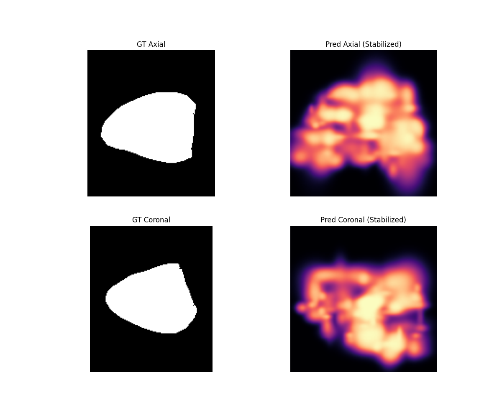
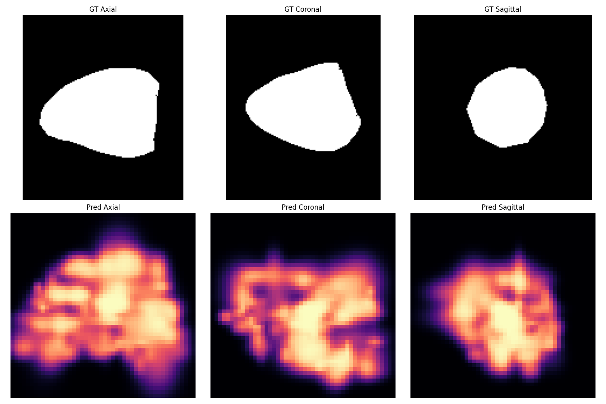

# Cardiac Reconstruction from Sparse Imaging via Stabilized Gaussian Occupancy Fields

## Abstract
Accurate 3D reconstruction from sparse 2D imaging remains a useful testbed for studying explicit geometric representations and differentiable supervision. This project explores a Gaussian occupancy formulation in which anatomy is modeled as a set of explicit 3D Gaussian primitives rather than a pure implicit neural field. The current codebase includes stabilized occupancy aggregation, voxel-grounded initialization, a direct subject-fitting path, and mesh extraction via marching cubes. The best current artifact in this repository is a subject-specific fitted reconstruction on a validation example that reaches sampled occupancy accuracy `0.9655` and sampled IoU `0.9503`, while also producing an interpretable surface mesh for side-by-side comparison against ground truth.

## Introduction
Standard sparse imaging setups often lack enough context for direct volumetric reconstruction. This repository investigates whether an explicit field of Gaussian occupancy kernels can serve as a stable intermediate representation for sparse cardiac reconstruction. The emphasis is not yet on broad subject generalization, but on making the geometry, supervision path, and extracted surfaces easy to inspect. The project therefore sits between a pure research prototype and a visualization-first reconstruction system.

## Materials and Methods

### 1. Gaussian Occupancy Fields
The reconstructed anatomy is represented by a collection of anisotropic Gaussian kernels. Each Gaussian carries a mean position, axis-aligned scale, and opacity. Occupancy at a query point is computed with a non-saturating density rule:

`occupancy(x) = 1 - exp(-sum_i alpha_i * w_i(x))`

where `w_i(x)` is the Gaussian weight of primitive `i` at spatial location `x`. This avoids the earlier saturation failure mode from naive sum-and-clamp aggregation.

### 2. Latent Dynamics
An earlier Neural ODE path remains in the repository, but the strongest current reconstruction result comes from a static subject-specific fitting procedure rather than from temporal latent evolution. The ODE branch is therefore still best interpreted as an experimental extension rather than the current mainline result.

### 3. Differentiable Rasterization
The project includes a differentiable slice rasterizer for sparse-view supervision. In the Gaussian pipeline, rendered slices are used to keep the learned occupancy field aligned with observed sparse views. This supervision is still relatively lightweight compared with the volumetric occupancy fitting term, but it keeps the reconstruction anchored to visible image planes.

### 4. Multi-view Pose Optimization
A differentiable pose optimizer is available to refine slice alignment in the encoder-based training path. For the current best subject-fit result, the more important factors are voxel-grounded initialization and direct occupancy fitting, but the pose infrastructure remains useful for the broader sparse-slice formulation.

### 5. Subject-Specific Gaussian Fitting
The strongest current artifact in the repository is produced by directly fitting Gaussian parameters to a single validation subject. Gaussian centers are initialized from occupied label voxels, then optimized with sampled occupancy supervision. This path bypasses the harder problem of jointly learning a cross-subject encoder and a reconstruction head, and it produces a cleaner surface mesh for qualitative analysis.

### 6. Mesh Extraction and Visualization
After fitting, the occupancy field is sampled on a regular grid and converted to a triangular surface with marching cubes at the `0.5` isosurface. The repository now includes both predicted and ground-truth meshes in the GitHub Pages site, enabling direct side-by-side visual comparison.

## Results

### 1. Quantitative Status
The current best tracked result in this repository is the subject-fit reconstruction stored under `runs/subject_fit_v01`. On sampled evaluation points from the corresponding validation volume, it reports:

- Sampled occupancy accuracy: `0.9655`
- Sampled IoU: `0.9503`
- Mean predicted occupancy on sampled labeled wall points: `0.7265`
- Mean predicted occupancy on sampled uniform points: `0.0653`

These metrics indicate that the Gaussian field is no longer collapsing to a trivial solution and can recover a geometrically meaningful occupied region for the chosen subject.

### 2. Spatial Fidelity
The strongest current reconstruction yields a coherent ventricular-like envelope and substantially cleaner orthogonal slice comparisons than the earlier stabilization checkpoints. The predicted volume is still smoother than the label-derived surface, but it now tracks the global shape well enough to support direct mesh extraction and visual comparison.

*Figure 1. Ground-truth and predicted slice comparisons from the current subject-fit reconstruction.*

*Figure 2. Additional axial, coronal, and sagittal views of the reconstructed occupancy field.*

### 3. Temporal Dynamics
Temporal dynamics remain secondary in the current repository state. The animation scripts are still present and useful for inspecting continuity in the latent-dynamics branch, but the current report should be read as a static reconstruction update rather than as a validated 4D motion study.

## Discussion
This repository has moved from a saturation-prone Gaussian prototype to a working Gaussian occupancy reconstruction path with extractable mesh results. The main improvement is conceptual rather than architectural complexity: explicit Gaussian geometry, stabilized density aggregation, and direct subject fitting make it easier to inspect what the representation is actually learning.

That said, the project is still narrower than the earlier INR-based cardiac reconstruction project in `/home/sofa/host_dir/cardiac_reconstruction_project`. The current best result here is a subject-specific fit, not a general-purpose model with strong cross-subject evaluation. The Gaussian formulation is useful because it makes the geometry explicit and visually interpretable, but it has not yet matched the broader experimental maturity of the older INR pipeline.

The remaining technical gaps are clear:

- improve cross-subject learning rather than relying on direct subject fitting,
- better control surface sharpness without over-thickening the wall,
- validate mesh quality with stronger geometric metrics than point-sampled occupancy alone,
- and reintroduce temporal dynamics only after the static geometry path is consistently reliable.

## Conclusion
The current state of the project is best described as a working Gaussian occupancy reconstruction prototype with mesh-based visualization. It now produces a credible subject-specific 3D surface and quantitative occupancy metrics that are strong enough for inspection and presentation. Its strongest contribution relative to the older cardiac reconstruction repository is not broader evaluation, but a different representation choice: explicit stabilized Gaussian occupancy fields that can be directly turned into meshes and compared visually against ground truth.
